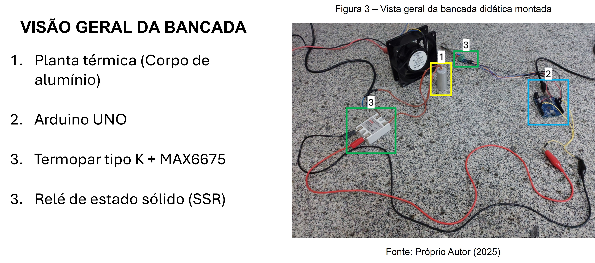

# 🌡️ Bancada Didática de Controle de Temperatura (Arduino + PID)

Este repositório contém todo o material necessário para reproduzir uma bancada didática de controle térmico de baixo custo. O projeto abrange desde a usinagem da planta mecânica e esquemáticos eletrônicos até o firmware para controle **On-Off** e **PID Digital**.

[cite_start]*Figura: Visão geral da bancada com planta térmica, driver de potência e controlador[cite: 84].*

## 🎯 Visão Geral
[cite_start]O projeto utiliza um corpo de prova de alumínio usinado como planta térmica[cite: 92]. [cite_start]O objetivo é demonstrar na prática a diferença entre um controle simples (On-Off) e um controle proporcional-integral-derivativo (PID) sintonizado via método de Ziegler-Nichols[cite: 9].

* [cite_start]**Atuador:** Relé de Estado Sólido (SSR) com técnica de *Slow PWM* (Janela de 8s)[cite: 127, 128].
* [cite_start]**Sensor:** Termopar Tipo K com interface MAX6675[cite: 112, 113].
* [cite_start]**Controlador:** Arduino UNO (Amostragem de 250ms)[cite: 124].

## 📂 Estrutura do Repositório

### 1. Firmware (`/firmware`)
Contém os códigos fonte em C++ para Arduino IDE:
* **Control_PID:** Implementa o algoritmo PID completo usando a biblioteca `PID_v1`. [cite_start]Inclui rotinas de segurança contra falha do sensor e modulação temporal do relé [cite: 254-346].
* **Control_OnOff:** Implementa a lógica de histerese (±0,5°C) para fins comparativos [cite: 347-421].

**Dependências (Bibliotecas):**
* [cite_start][`MAX6675` da Adafruit](https://github.com/adafruit/MAX6675-library) [cite: 228]
* [cite_start][`PID` de Brett Beauregard](https://github.com/br3ttb/Arduino-PID-Library) [cite: 230]

### 2. Hardware Mecânico (`/hardware/mechanical`)
[cite_start]Arquivos para fabricação do corpo de prova cilíndrico (Ø26mm x 61mm)[cite: 93].
* [cite_start]📄 **Desenhos Técnicos:** Dimensões para usinagem dos furos do cartucho e rosca M6 do sensor.
* 🧊 **Modelos 3D:** Arquivos disponíveis em `.f3d` (Fusion 360) e `.step` (Universal).

### 3. Eletrônica (`/hardware/electronics`)
Projeto do circuito de acionamento e leitura.
* Disponível em formato PDF para consulta rápida.
* Arquivos fonte do **KiCad** para edição da PCB/Esquemático.

## 📊 Resultados Comparativos
A bancada permite visualizar claramente a diferença de desempenho entre as técnicas:

| Controle | Comportamento Observado |
| :--- | :--- |
| **On-Off** | Oscilação contínua de ~15°C (pico-a-pico) em torno do Setpoint[cite: 10, 197]. |
| **PID** | Estabilização no Setpoint (50°C) com erro estacionário desprezível após sintonia[cite: 10, 219]. |

*Exemplo de resposta do sistema controlado via PID[cite: 202].*

## 🚀 Como Reproduzir
1.  **Usinagem:** Utilize os desenhos na pasta `mechanical` para usinar o bloco de alumínio.
2.  **Eletrônica:** Monte o circuito conforme o esquema na pasta `electronics` (Arduino + SSR + MAX6675)[cite: 115].
3.  **Software:** Instale as bibliotecas listadas acima, abra o arquivo `.ino` desejado na Arduino IDE e faça o upload.
4.  **Visualização:** Abra o *Serial Plotter* (115200 baud) para ver as curvas em tempo real[cite: 133].

## 📄 Licença
Este projeto é Open Source. Sinta-se livre para estudar, modificar e contribuir.
